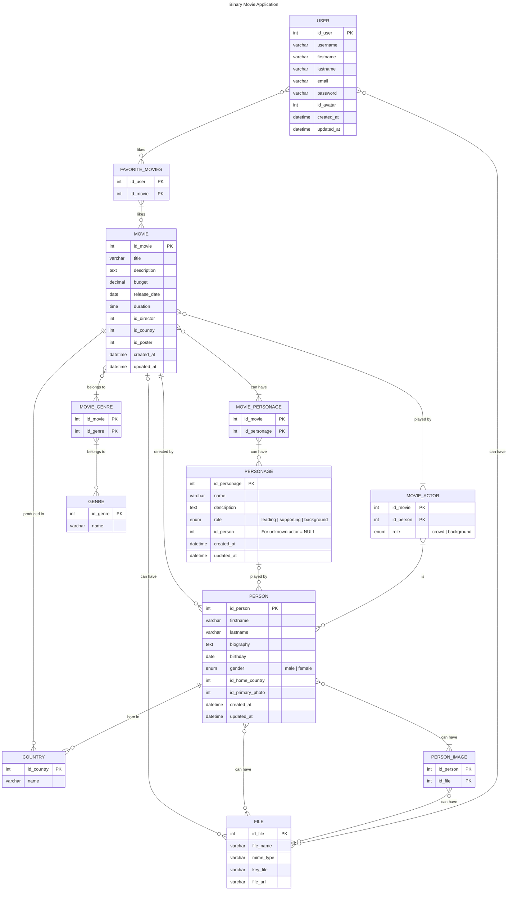

# Movie Application

```mermaid
---
title: Binary Movie Application
---

erDiagram
    MOVIE 1--0+ PERSON : "directed by"
    MOVIE 1--0+ COUNTRY : "produced in"
    MOVIE 0+--1+ MOVIE_GENRE : "belongs to"
    MOVIE 0+--1+ MOVIE_PERSONAGE : "can have"
    MOVIE 0+--1+ MOVIE_ACTOR : "played by"
    MOVIE |o--0+ FILE : "can have"
    MOVIE {
        int id_movie PK
        varchar title
        text description
        decimal budget
        date release_date
        time duration
        int id_director
        int id_country
        int id_poster
        datetime created_at
        datetime updated_at
    }

    COUNTRY {
        int id_country PK
        varchar name
    }

    MOVIE_GENRE 1+--0+ GENRE : "belongs to"
    MOVIE_GENRE {
        int id_movie PK
        int id_genre PK
    }

    GENRE {
        int id_genre PK
        varchar name
    }

    MOVIE_PERSONAGE 1+--0+ PERSONAGE : "can have"
    MOVIE_PERSONAGE {
        int id_movie PK
        int id_personage PK
    }

    PERSONAGE |o--0+ PERSON : "played by"
    PERSONAGE {
        int id_personage PK
        varchar name
        text description
        enum role "leading | supporting | background"
        int id_person "For unknown actor = NULL"
        datetime created_at
        datetime updated_at
    }

    MOVIE_ACTOR 1+--0+ PERSON : "is"
    MOVIE_ACTOR {
        int id_movie PK
        int id_person PK
        enum role "crowd | background"
    }

    PERSON 1--0+ COUNTRY : "born in"
    PERSON 0+--0+ FILE : "can have"
    PERSON 0+--1+ PERSON_IMAGE : "can have"
    PERSON {
        int id_person PK
        varchar firstname
        varchar lastname
        text biography
        date birthday
        enum gender "male | female"
        int id_home_country
        int id_primary_photo
        datetime created_at
        datetime updated_at
    }

    PERSON_IMAGE 0+--0+ FILE : "can have"
    PERSON_IMAGE {
        int id_person PK
        int id_file PK
    }

    USER 0+--0+ FILE : "can have"
    USER 0+--0+ FAVORITE_MOVIES : "likes"
    USER {
        int id_user PK
        varchar username
        varchar firstname
        varchar lastname
        varchar email
        varchar password
        int id_avatar
        datetime created_at
        datetime updated_at
    }

    FILE {
        int id_file PK
        varchar file_name
        varchar mime_type
        varchar key_file
        varchar file_url
    }

    FAVORITE_MOVIES 1+--0+ MOVIE : "likes"
    FAVORITE_MOVIES {
        int id_user PK
        int id_movie PK
    }
```
